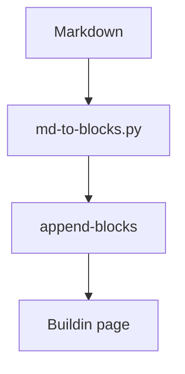

# Rich blocks demo

Демо-документ для проверки конвертера `md-to-blocks.py`. Покрывает все
поддерживаемые блоки. Опубликуй его на любую страницу Buildin и сравни рендер.

Абзац с **жирным**, *курсивом*, `inline-кодом` и [ссылкой](https://buildin.ai).

## Списки

- пункт раз
  - вложенный
    - ещё глубже
- пункт два

1. первый
2. второй

- [ ] невыполненная задача
- [x] выполненная задача

## Выноска и разделитель

> ⚠️ Callout с эмодзи-иконкой. Ведущий эмодзи становится иконкой блока.

---

## Таблица

| Колонка A | Колонка B |
|-----------|-----------|
| строка    | 123       |
| `код`     | текст     |

## Код и диаграммы

```swift
let greeting = "Hello, Buildin"
```



<!-- collapse -->
## Сворачиваемая секция

Эта секция и всё её содержимое свернутся в toggle (тип 38) — до следующего
заголовка того же или более высокого уровня.

- список внутри toggle
- второй пункт
